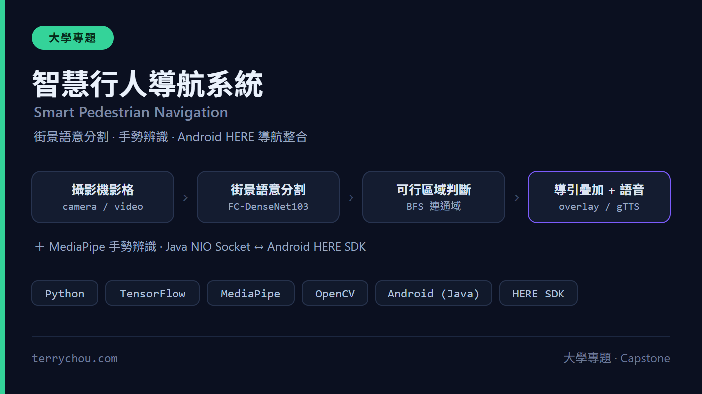
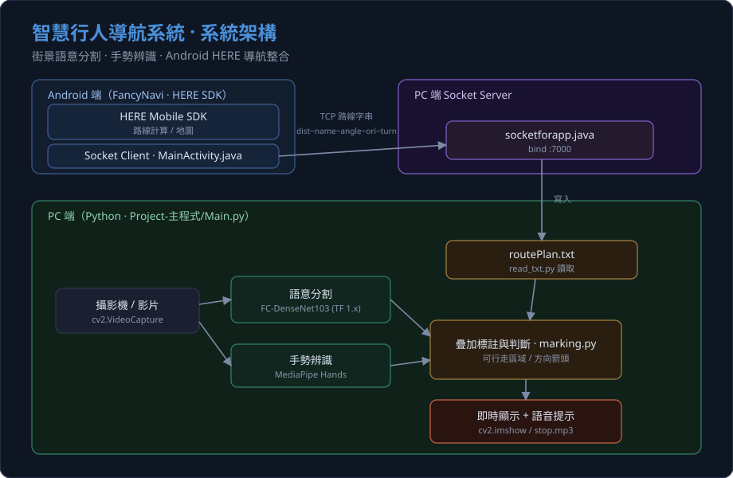

# 結合街景分析與燈號辨識之智慧行人導航系統

> 一套整合「街景語意分割」「手勢辨識」「手機導航」三大模組的視障行人輔助導航專題：以 PC 端 Python（TensorFlow 1.x + MediaPipe）即時分析攝影機畫面，透過 Socket 與 Android 端 HERE 地圖 App 互通路線資訊，協助使用者判斷可行走區域與路口資訊。

<p align="center"></p>


-FF6F00?logo=tensorflow&logoColor=white)


> ⚠️ **專題／研究用途說明**
> 本專案為學生專題作品，僅供研究與展示。它**不是**通過驗證的輔具或醫療器材，**請勿**作為視障者實際出行的唯一依據。系統行為受模型準確度、攝影機角度、網路延遲等因素影響，使用風險由使用者自行承擔。

---

## 這是什麼

本系統把「看路」「比手勢」「導航」三件事串成一條資料流，目標情境是**輔助視障行人在街道上行走**：

- **街景語意分割**：用攝影機畫面跑語意分割模型（FC-DenseNet103），辨識畫面中的「道路」區域，並判斷使用者目前是否站在可行走的路面上。
- **手勢辨識**：用 MediaPipe 偵測手部關鍵點，當偵測到「張開手掌（Open）」時輸出 `Stop` 訊號（情境上對應「攔公車／停止」），並播放語音提示。
- **手機導航**：Android 端基於開源專案 **FancyNavi**（HERE Mobile SDK）計算路線，將「距離、路名、轉彎角度、方位、下一個轉向」等資訊透過 TCP Socket 傳到 PC 端，疊加在分割結果畫面上。

三個模組由 PC 端主程式 `Project-主程式/Main.py` 整合：每隔數幀擷取一張畫面 → 跑分割 → 跑手勢 → 讀取手機傳來的最新路線資訊 → 合成標註後即時顯示。

> 本 README 為**整個 repo 的單一入口**，串起以下三個（含工具共四個）子資料夾。各子資料夾沿用其上游專案的程式碼結構。

---

## ✨ 技術亮點

- **三模組異質整合**：把 TensorFlow 語意分割、MediaPipe 手勢、Android HERE 導航三套技術用「檔案 + Socket」鬆耦合地接在一起，PC 與手機各司其職。
- **可行走區域判斷**：`marking.py` 對分割輸出的「道路」色塊（RGB `128,64,128`）做 BFS 連通區域分析，計算面積與重心；以畫面底部中央是否落在道路色塊、且面積大於門檻（300 px）來判斷「是否站在路面上」。
- **方向箭頭疊加**：依手機端回傳的轉彎角度，把 `arrow.png` 旋轉後貼到道路重心位置，於畫面上指示前進方向。
- **手勢即時提示**：手勢分類結果寫入文字檔，偵測到 `Open` 時輸出 `Stop` 並以 `playsound` 播放 `stop.mp3` 語音（語音檔可由 gTTS 產生）。
- **跨裝置通訊**：Android App 作為 client 連到 PC 端 server，路線資訊以 `~` 分隔字串傳輸並追加寫入 `output/routePlan.txt`；PC 端提供 Java（`socketforapp.java`，效能較佳）與 Python（`server.py`）兩種接收實作。
- **可自訂語意標籤配色**：附 `change_color` 工具，依 `setting.txt` 的「原始 RGB → 目標 RGB」對照批次替換資料集標註圖配色，方便混用不同來源的標註資料。
- **金鑰外部化**：HERE App ID／Code／License／XYZ Token 一律經 `local.properties`（不進版控）於編譯期由 `BuildConfig` 注入，原始碼不含明文金鑰；HERE SDK 二進位檔亦排除於版控外。

---

## 🏗️ 架構

<p align="center"></p>

> 資料流摘要：手機端用 HERE SDK 算路線 → 透過 Socket 把路線資訊傳到 PC 端寫入 `routePlan.txt` → PC 端主程式同時跑分割與手勢，並讀取最新路線資訊，全部疊加在同一張畫面上即時顯示。

---

## 🚀 快速開始

### 0. 取得程式碼

```bash
git clone https://github.com/q86865511/Smart-Pedestrian-Navigation-via-Scene-Analysis-and-Traffic-Light-Detection.git
cd Smart-Pedestrian-Navigation-via-Scene-Analysis-and-Traffic-Light-Detection
```

### 1. 環境需求（PC 端）

- Python 3.x
- TensorFlow 1.x（程式以 `tensorflow.compat.v1` 方式呼叫；訓練端另需 `tf_slim`）
- OpenCV（`cv2`）、NumPy、Pillow（PIL）
- MediaPipe（手勢辨識）
- `pyscreenshot`、`playsound`、`gtts`（語音相關，視使用情境而定）
- Java（執行 `socketforapp.java`，效能優於 Python 版）

> 本專案未提供 `requirements.txt`，請依上列套件自行安裝。TensorFlow 1.x 安裝細節見「已知限制」。

### 2. 下載資料集（訓練用，必要時）

訓練資料夾 `Semantic-Segmentation-街景分析訓練/CamVid/` 與主程式 `Project-主程式/CamVid/` 內**僅附 `class_dict.csv`（類別與配色定義）**，不含影像資料。若要自行訓練，請下載 CamVid 資料集影像並放入對應資料夾：

- **CamVid（Cambridge-driving Labeled Video Database）**：
  - Kaggle 整理版（含影像與標註遮罩）：<https://www.kaggle.com/datasets/carlolepelaars/camvid>
  - 原始學術來源（Cambridge）：<http://mi.eng.cam.ac.uk/research/projects/VideoRec/CamVid/>
  - 本專案訓練框架沿用 [Semantic-Segmentation-Suite](https://github.com/GeorgeSeif/Semantic-Segmentation-Suite)，該 repo 亦附 11 類版本的 CamVid 可直接使用。
- **補充資料集 = BDD100K 語意分割子集**（本專題最終採 CamVid : BDD = 1:1 混合；亦對應預設 checkpoint 路徑中的 `BDD-512-640`）：
  - 官方下載（需註冊並同意授權）：<https://bdd-data.berkeley.edu/>
  - 下載說明文件：<https://doc.bdd100k.com/download.html>（語意分割為其中的 `10K Images` + `Segmentation` 標註）
  - ETH 鏡像：<https://dl.cv.ethz.ch/bdd100k/data/>

> 若只是要跑主程式 inference，可不下載完整資料集，但需要預訓練模型（見下一步）。

### 3. 下載預訓練模型 / Checkpoint（執行主程式必要）

模型權重（`*.ckpt` / `model.h5` 等）已依 `.gitignore` 排除於版控外。請從 Release 或雲端下載並放到主程式預期路徑：

- 預訓練 checkpoint 下載：本專案自行訓練的 FC-DenseNet103 權重未公開於版控。**請將你訓練好的權重上傳到本 repo 的 [GitHub Releases](https://github.com/q86865511/Smart-Pedestrian-Navigation-via-Scene-Analysis-and-Traffic-Light-Detection/releases) 或雲端硬碟，再把連結填於此處**；或依下方「訓練」步驟用 CamVid + BDD 自行重新訓練產生。
- 預設路徑（`Main.py` 的 `--checkpoint_path` 預設值）：
  `Project-主程式/BDD-512-640/Checkpoint/latest_model_FC-DenseNet103_CamVid.ckpt`

### 4. （選用）自行訓練語意分割模型

進入 `Semantic-Segmentation-街景分析訓練/` 執行 `train.py`：

```bash
cd Semantic-Segmentation-街景分析訓練
python train.py --num_epochs 300 --frontend InceptionV4 --model FC-DenseNet103 --crop_height 512 --crop_width 512 --dataset CamVid
```

- 支援模型（`builders/model_builder.py`）：`FC-DenseNet56 / FC-DenseNet67 / FC-DenseNet103 / Encoder-Decoder / Encoder-Decoder-Skip / RefineNet` 等。
- 支援 frontend：`ResNet50 / ResNet101 / ResNet152 / MobileNetV2 / InceptionV4`。
- `train.py` 預設 `--model FC-DenseNet56`、`--frontend ResNet101`，本專題實際採用 FC-DenseNet103。
- 訓練產出（checkpoints 與分析圖）會存放在同一資料夾；另有 `train_without_drawPicture.py`（不輸出分析圖的版本）、`test.py`、`predict.py` 供測試與單張預測。

#### （選用）轉換標註配色

若需統一不同來源的標註圖配色，使用 `change_color-更改資料集顏色/` 工具：

```bash
cd change_color-更改資料集顏色
python a.py ex/      # 處理 ex/ 資料夾內所有 .png/.jpg，結果輸出到 ex/output/
```

- 顏色對照在 `setting.txt`，每行格式為 `原始R,G,B 目標R,G,B`。

### 5. 啟動 PC 端 Socket Server（接收手機路線資訊）

在 `Project-主程式/` 內，用 Java 執行 `socketforapp.java`（會監聽埠 `7000`，並把收到的路線字串追加寫入 `output/routePlan.txt`）：

```bash
cd Project-主程式
javac socketforapp.java
java socket.socketforapp
```

> `socketforapp.java` 內的監聽 IP（預設 `192.168.71.199`）需改成**執行主程式電腦**的實際 IP。
> 另提供純 Python 版接收程式 `server.py`（效能較慢）；`client.py` / `server.py` 的圖片傳送功能目前未啟用。

### 6. 執行整合主程式

```bash
cd Project-主程式
python Main.py
```

**可用參數：**

| 參數 | 預設值 | 說明 |
|------|--------|------|
| `--inputVideo` | `no` | 影片路徑；為 `no` 時改用攝影機（裝置 0） |
| `--image` | `output/output.jpg` | 預測用的圖片路徑 |
| `--checkpoint_path` | `BDD-512-640/Checkpoint/latest_model_FC-DenseNet103_CamVid.ckpt` | 模型 checkpoint 路徑 |
| `--crop_height` | `480` | 輸入裁切高度 |
| `--crop_width` | `640` | 輸入裁切寬度 |
| `--model` | `FC-DenseNet103` | 模型名稱 |
| `--dataset` | `CamVid` | 資料集名稱（用以讀取 `CamVid/class_dict.csv`） |

使用影片來源範例：

```bash
python Main.py --inputVideo Video/test.mp4
```

執行後，分割結果、手勢結果、合成標註圖等會輸出到 `Project-主程式/output/`。

### 7. 設定並執行 Android App（FancyNavi）

App 位於 `FancyNavi-master-手機APP程式/`，以 Android Studio 開啟（`minSdkVersion 26`、`compileSdkVersion 30`）。

1. **放入 HERE SDK 二進位檔**：到 [HERE Developer Portal](https://developer.here.com/?create=Evaluation&keepState=true&step=terms) 申請 Premium SDK evaluation，下載後把 `HERE-sdk.aar`、（如有用）`MSDKUILib-release.aar` 及相依 `.jar` 放到 `app/libs/`（這些檔案依授權限制不入版控，詳見 `app/libs/README.md`）。
2. **設定 HERE 憑證**：在專案根目錄 `local.properties`（不進版控）填入：
   ```properties
   here.app.id=YOUR_HERE_APP_ID
   here.app.code=YOUR_HERE_APP_CODE
   here.license.key=YOUR_HERE_LICENSE_KEY
   here.xyz.token=YOUR_HERE_XYZ_HUB_TOKEN
   ```
   這些值會於編譯期透過 `BuildConfig` 注入，原始碼不含明文金鑰。
3. **設定連線目標（指向跑主程式的電腦）**：編輯
   `app/src/main/java/com/fancynavi/android/app/MainActivity.java`
   - 第 **267** 行：`InetAddress.getByName("...")` 的 IP
   - 第 **269** 行：`int serverPort = 7000;` 的 Port

   並確認與 PC 端 `socketforapp.java` 的 IP／Port 一致。

> ⚠️ 若你 fork 自舊版本：舊 commit 可能曾含明文金鑰，請務必到 HERE 後台 **revoke** 那些舊金鑰。

---

## 🧪 測試

- **CI 語法守門**：[`.github/workflows/ci.yml`](.github/workflows/ci.yml) 在每次 push / PR 對所有 `.py` 跑 `python -m py_compile`（零依賴的語法檢查）。主程式相依（OpenCV / TensorFlow 1.x / MediaPipe）需 GPU 與舊版環境,無法在公開 CI 安裝,故不在 CI 執行；Android Gradle build 需 Android SDK + HERE SDK 授權二進位,亦不在此跑。
- 子資料夾 `FancyNavi-master-手機APP程式/.github/workflows/build.yaml` 為上游 FancyNavi 帶入的 Android 建置工作流程。
- 尚無**功能/單元測試**(待補)。
- 語意分割端可用 `Semantic-Segmentation-街景分析訓練/test.py`、`predict.py` 對既有模型做評估與單張預測（需自備資料集與 checkpoint）。

---

## ⚠️ 已知限制

- **TensorFlow 1.x 已 EOL**：程式以 `tensorflow.compat.v1`（含 `disable_eager_execution`）與 `tf_slim` 撰寫，僅相容 TF 1.x 生態。TF 1.x 已停止維護，於新版 Python／CUDA 環境安裝困難，建議使用對應的舊版環境或容器。
- **硬編碼 IP／Port**：PC 端 `socketforapp.java` 與 Android 端 `MainActivity.java` 的連線位址寫死在原始碼（埠 `7000`），換網路環境須手動修改兩端並重新編譯。
- **同網段需求**：手機與 PC 需在可互通的區域網路內，且 PC 端防火牆需開放對應埠。
- **HERE SDK 為付費／受授權限制**：需自行申請 HERE Premium SDK 評估授權與憑證；HERE Mobile SDK（Premium）V3.x 為較舊版本。
- **資料集與模型未隨附**：CamVid 影像、補充資料集與訓練好的 checkpoint 皆需另行下載（見快速開始）。
- **手勢語意有限**：手勢端目前主要使用「Open → Stop」對應，並非完整手語或多手勢指令集。
- **非正式輔具**：請參閱頂部風險聲明，本系統未經輔具／安全認證。

---

## 📄 授權與來源

### 授權

- 本整合專題的**原創整合 / 串接程式碼**以 **MIT License** 釋出，詳見 [`LICENSE`](LICENSE)。
- 但本專案**整合了多個上游元件**（下表），這些元件**各自保留其原始授權**；MIT 僅涵蓋本專案自寫的整合程式碼。使用前請務必同時遵守各上游授權（HERE SDK 二進位檔受授權限制、**不可重新散布**）。

### 第三方來源與素材

| 模組 / 素材 | 來源 | 說明 |
|------|------|------|
| 街景語意分割 | [Semantic-Segmentation-Suite](https://github.com/GeorgeSeif/Semantic-Segmentation-Suite) | 訓練與推論框架（FC-DenseNet 等模型） |
| 手機導航 App | [FancyNavi](https://github.com/aquawill/FancyNavi) | 基於 HERE Mobile SDK 的 Android 導航範例 |
| 手勢辨識 | [hand-gesture-recognition-mediapipe](https://github.com/kinivi/hand-gesture-recognition-mediapipe) | MediaPipe 手部關鍵點與手勢分類 |
| 導航地圖 SDK | [HERE Mobile SDK for Android (Premium) V3.x](https://developer.here.com/) | 受授權限制，不隨附二進位檔，需自行下載 |
| 圖示素材 | Flaticon（Vectors Market / Freepik / Smashicons / itim2101） | 沿用自 FancyNavi，詳見 `FancyNavi-master-手機APP程式/README.md` |
| 資料集 | CamVid（及自行補充之資料集） | 影像未隨附，需自行取得 |
| 中文字型 | [Taipei Sans TC Beta](https://github.com/ButTaiwan/tpsans) | `Project-主程式/marking.py` 以 PIL 繪製中文標註用；開源字型（免費可商用），隨附於 `Project-主程式/TaipeiSansTCBeta-Regular.ttf` |

> 註：原本另隨附了一份**未被程式使用**的專有字型 `標楷體.ttf`（DFKai-SB，Windows 內建，~10MB），因有再散布授權疑慮且程式碼未引用，已自版控移除。

> 使用本專案前，請務必遵守上述各上游專案與 HERE SDK 的授權條款；HERE SDK 二進位檔不可重新散布。
